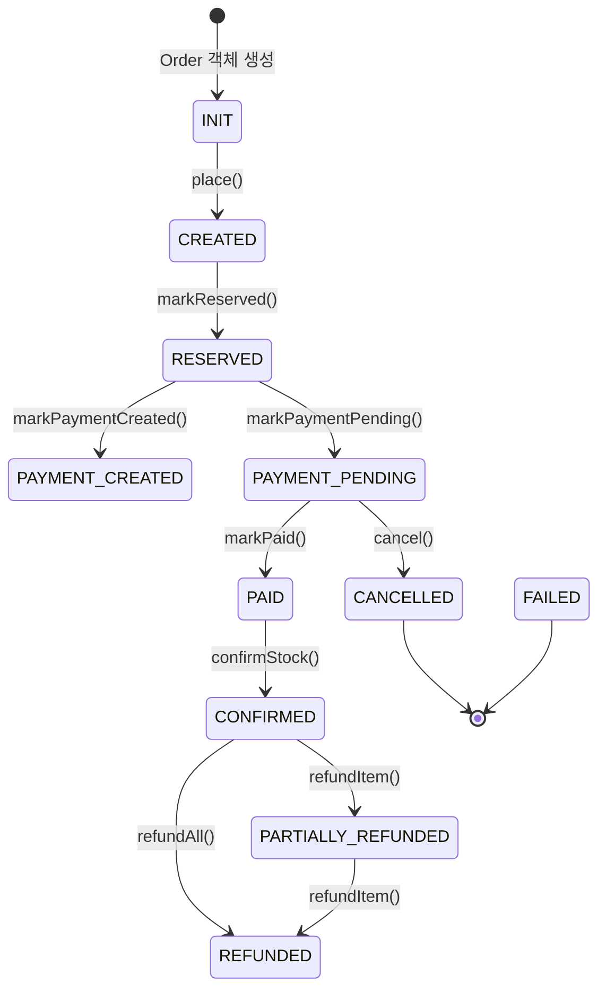

# 주문 상태 머신

## 상태 정의

```kotlin
enum class OrderStatus {
    INIT,               // 주문 객체 생성 (초기화 전)
    CREATED,            // 주문 생성 완료
    RESERVED,           // 재고 예약 완료
    PAYMENT_CREATED,    // 결제 초기화 완료
    PAYMENT_PENDING,    // 결제 대기 중
    PAID,               // 결제 완료
    CONFIRMED,          // 재고 확정 차감 완료
    PARTIALLY_REFUNDED, // 부분 환불
    REFUNDED,           // 전체 환불
    CANCELLED,          // 결제 취소
    FAILED,             // 실패
}
```

| 상태 | 설명 |
|------|------|
| `INIT` | Order 객체가 생성된 직후 초기 상태 |
| `CREATED` | 주문이 정상적으로 생성되어 이벤트 발행 준비 완료 |
| `RESERVED` | Inventory Service에서 재고 예약이 완료된 상태 |
| `PAYMENT_CREATED` | Payment Service에서 결제 객체가 생성된 상태 |
| `PAYMENT_PENDING` | 결제 대기 중 (사용자 결제 승인 대기) |
| `PAID` | 결제가 완료된 상태 |
| `CONFIRMED` | 재고 확정 차감까지 완료된 최종 성공 상태 |
| `PARTIALLY_REFUNDED` | 일부 아이템이 환불된 상태 |
| `REFUNDED` | 전체 환불 완료 상태 |
| `CANCELLED` | 결제 실패 또는 재고 확정 실패로 취소된 상태 |
| `FAILED` | 재고 예약 실패 등으로 주문이 실패한 상태 |

## 상태 전이 다이어그램



**정상 흐름**: `INIT -> CREATED -> RESERVED -> PAYMENT_PENDING -> PAID -> CONFIRMED`

**실패 흐름**:
- 재고 예약 실패: `CREATED -> FAILED`
- 결제 실패: `PAYMENT_PENDING -> CANCELLED`
- 재고 확정 실패: `PAID -> CANCELLED`

**환불 흐름**:
- 부분 환불: `CONFIRMED -> PARTIALLY_REFUNDED`
- 전체 환불: `CONFIRMED -> REFUNDED` 또는 `PARTIALLY_REFUNDED -> REFUNDED`

## 상태 전이 규칙

Order 엔티티는 상태 전이 메서드에서 **현재 상태를 검증**하여 잘못된 전이를 방지합니다.

### markReserved()

```kotlin
fun markReserved() {
    if (status != OrderStatus.CREATED && status != OrderStatus.PAYMENT_CREATED) {
        throw InvalidOrderStatus()
    }
    status = OrderStatus.RESERVED
    updatedAt = LocalDateTime.now()
}
```

- 허용 상태: `CREATED`, `PAYMENT_CREATED`
- 전이 결과: `RESERVED`

### markPaid()

```kotlin
fun markPaid(paidAmount: Money) {
    if (status != OrderStatus.PAYMENT_PENDING) {
        throw InvalidOrderStatus()
    }
    if (paidAmount != payableAmount) {
        throw PaymentMisMatch()
    }
    status = OrderStatus.PAID
    updatedAt = LocalDateTime.now()
}
```

- 허용 상태: `PAYMENT_PENDING`
- 전이 결과: `PAID`
- 추가 검증: 결제 금액과 주문 결제 요청 금액 일치 여부

### confirmStock()

```kotlin
fun confirmStock() {
    if (status != OrderStatus.PAID) {
        throw InvalidOrderStatus("재고 확정은 결제 완료 상태에서만 가능합니다. 현재 상태: $status")
    }
    status = OrderStatus.CONFIRMED
    updatedAt = LocalDateTime.now()
}
```

- 허용 상태: `PAID`
- 전이 결과: `CONFIRMED`

## 상태 기반 멱등성 보장

상태 머신은 멱등성 보장의 2차 방어선 역할을 합니다.

### 동작 원리

1. 중복 이벤트가 도착하면, 이미 상태가 전이된 상태이므로 `InvalidOrderStatus` 예외 발생
2. 예외가 발생해도 데이터 정합성은 유지됨 (잘못된 전이가 차단되므로)
3. Fast-path 멱등성 체크를 통과하더라도, 상태 전이 규칙에서 최종 차단

### 이점

- **잘못된 상태 전이를 도메인 레벨에서 차단**: 비즈니스 규칙 위반을 원천 방지
- **중복 이벤트에 대한 멱등성 2차 보장**: Fast-path 체크가 race condition으로 실패해도 안전
- **비즈니스 규칙을 엔티티에 캡슐화**: 상태 전이 로직이 도메인 모델에 집중되어 유지보수 용이

### 멱등성 방어 계층

```
1차 방어 - Fast-path DB 조회 (order_event_idempotency 테이블)
    ↓ (통과)
2차 방어 - 상태 머신 전이 규칙 (Order 엔티티 메서드)
    ↓ (통과)
3차 방어 - Unique Constraint (DB 제약조건)
```

이 3중 방어 구조를 통해, Kafka Consumer가 동일 이벤트를 중복 수신하더라도 데이터 정합성이 보장됩니다.
