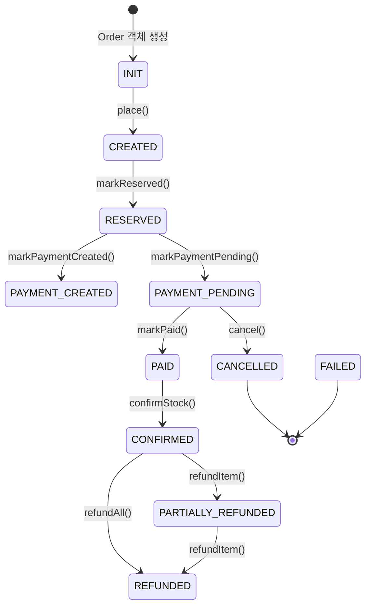

# Order Service

주문 생성부터 확정/취소까지의 전체 라이프사이클을 관리하며, Saga 패턴 기반 분산 트랜잭션 오케스트레이션을 담당하는 서비스입니다.

## 📋 목차

- [개요](#-개요)
- [핵심 기술 성과](#-핵심-기술-성과)
- [주문 상태 머신](#-주문-상태-머신)
- [분산 트랜잭션 처리](#-분산-트랜잭션-처리)
- [멱등성 보장](#-멱등성-보장)
- [이벤트 아키텍처](#-이벤트-아키텍처)
- [API 명세](#-api-명세)
- [데이터 모델](#-데이터-모델)

## 🎯 개요

Order Service는 이커머스 시스템의 핵심 오케스트레이터로, 주문 생성부터 결제 완료, 재고 확정까지의 복잡한 비즈니스 흐름을 조율합니다.

**주요 책임**:
- 주문 생성 및 검증
- Saga 패턴 기반 분산 트랜잭션 오케스트레이션
- 상태 머신 기반 주문 상태 관리
- Outbox 패턴을 활용한 이벤트 발행 (Debezium CDC)
- 이벤트 기반 멱등성 보장

**기술 스택**:
- Kotlin, Spring Boot 3.5.8
- MariaDB (JPA, QueryDSL)
- Kafka (CloudEvent 표준)
- Debezium CDC (Outbox 패턴)

## 🏆 핵심 기술 성과

### 1. Saga 패턴 분산 트랜잭션 구현

전통적인 2PC(Two-Phase Commit) 대신 **Choreography 기반 Saga 패턴**을 적용하여 분산 트랜잭션을 처리합니다.

**설계 결정**:
- 중앙 오케스트레이터 없이 각 서비스가 이벤트를 구독/발행하는 방식
- 보상 트랜잭션(Compensating Transaction)을 통한 롤백 처리
- 상태 전이 기반 멱등성으로 재시도 안정성 확보

**주문 생성 흐름**:

```
[Order Service]        [Inventory Service]      [Payment Service]
      |                        |                        |
  1. 주문 생성
     (INIT → CREATED)
      |
  2. OrderPlacedEvent 발행
      |----------------------->|
      |                   재고 예약 시도
      |                        |
      |<-----------------StockReservedEvent
  3. RESERVED 상태 전이
      |
  4. PaymentPendingEvent 전송
      |------------------------------------------------>|
      |                        |                   결제 처리
      |                        |                        |
      |<----------------------------------------PaymentCompletedEvent
  5. PAID 상태 전이
      |
  6. OrderConfirmedEvent 발행
      |----------------------->|
      |                   재고 확정 차감
      |                        |
      |<-----------------StockConfirmedEvent
  7. CONFIRMED 상태 전이
      |
   [주문 완료]
```

**보상 트랜잭션 흐름 1** (재고 예약 실패 시):

```
[Order Service]        [Inventory Service]
      |                        |
  1. StockReservationFailedEvent 수신
      |
  2. FAILED 상태 전이
      |
   [주문 실패 완료]
```

**보상 트랜잭션 흐름 2** (결제 실패 시):

```
[Order Service]        [Inventory Service]
      |                        |
  1. PaymentFailedEvent 수신
      |
  2. CANCELLED 상태 전이
      |
  3. OrderCancelledEvent 발행
      |----------------------->|
      |                   예약 해제
      |                   (재고 복원)
```

**보상 트랜잭션 흐름 3** (재고 확정 실패 시):

```
[Order Service]        [Inventory Service]      [Payment Service]
      |                        |                        |
  1. StockConfirmFailedEvent 수신
      |
  2. CANCELLED 상태 전이
      |
  3. OrderCancelledEvent 발행
      |----------------------->|
      |                   예약 해제               (환불 플로우 - 추후 구현)
      |                   (재고 복원)
```

### 2. Outbox 패턴 + Debezium CDC

**문제**: 데이터베이스 트랜잭션과 Kafka 이벤트 발행 사이의 원자성 보장 실패 가능성

**해결**: Outbox 패턴 적용

```kotlin
@Transactional
fun execute(command: CreateOrderCommand): CreateOrderResult {
    // 1. 주문 엔티티 저장
    val savedOrder = orderRepository.save(order)
    savedOrder.place()

    // 2. Outbox 테이블에 이벤트 저장 (같은 트랜잭션)
    integrationEventPublisher.publish(
        OrderPlacedEvent(
            orderId = savedOrder.id!!,
            userId = savedOrder.userId,
            correlationId = savedOrder.id.toString(),
            causationId = UUID.randomUUID().toString(),
        ),
    )
    // → OutboxIntegrationEventPublisher가 order_outbox 테이블에 INSERT

    return CreateOrderResult(savedOrder.id!!)
}
```

**Outbox Publisher 구현**:

```kotlin
@Component
class OutboxIntegrationEventPublisher(
    private val outboxRepository: OrderOutboxRepository,
    private val topicResolver: KafkaTopicResolver,
    @Value("\${spring.application.name}") private val source: String,
) : IntegrationEventPublisher {

    override fun publish(event: OrderIntegrationEvent) {
        val cloudEvent = event.toCloudEvent(source)
        val topic = topicResolver.resolve(event)
        val payload = objectMapper.writeValueAsString(cloudEvent)

        // Outbox 테이블에 저장 (도메인 로직과 동일 트랜잭션)
        val outboxEntry = OrderOutboxEntry.create(
            aggregateId = event.orderId.toString(),
            eventType = event.getEventType(),
            payload = payload,
            topic = topic,
            partitionKey = event.orderId.toString(),
        )
        outboxRepository.save(outboxEntry)
    }
}
```

**Debezium CDC**:
- `order_outbox` 테이블의 INSERT를 감지
- 자동으로 Kafka 토픽에 발행
- 데이터베이스 커밋 성공 = 이벤트 발행 보장

### 3. 상태 전이 기반 멱등성 보장

**문제**: Kafka Consumer가 같은 이벤트를 중복 수신할 가능성

**해결**: 2단계 멱등성 체크

1. **Fast-path check**: 처리 전 DB 조회
2. **State transition validation**: 상태 머신 규칙으로 2차 방어
3. **Idempotency record**: 처리 후 기록 (Unique Constraint)

```kotlin
@KafkaListener(
    topics = ["\${order.topic.mappings.payment.completed}"],
    groupId = "\${spring.kafka.consumer.group-id}",
)
fun onPaymentCompleted(@Valid event: CloudEvent<*>, ack: Acknowledgment) {
    val paymentCompleted = objectMapper.convertValue(event.data, PaymentCompletedEvent::class.java)

    // 1. Fast-path 멱등성 체크 (처리 전 조회)
    if (idempotencyChecker.isAlreadyProcessed(event.id, Actions.MARK_PAID)) {
        logger.info("Event already processed: eventId=${event.id}")
        ack.acknowledge()
        return
    }

    try {
        // 2. 비즈니스 로직 실행 (상태 전이 검증 포함)
        markOrderPaidUseCase.execute(
            MarkOrderPaidCommand(
                orderId = paymentCompleted.orderId,
                paidAmount = paymentCompleted.paidAmount,
            ),
            MessageContext(
                correlationId = paymentCompleted.correlationId,
                causationId = event.id,
            ),
        )

        // 3. 멱등성 기록 (Unique Constraint로 race condition 방어)
        idempotencyChecker.recordProcessed(
            eventId = event.id,
            action = Actions.MARK_PAID,
            orderId = paymentCompleted.orderId,
        )

        ack.acknowledge()
    } catch (e: Exception) {
        logger.error("Failed to process PaymentCompleted event", e)
        throw e  // 재시도
    }
}
```

**IdempotencyChecker**:

```kotlin
@Component
class IdempotencyChecker(private val idempotencyRepository: OrderIdempotencyRepository) {

    fun isAlreadyProcessed(eventId: String, action: String): Boolean =
        idempotencyRepository.existsByEventIdAndAction(eventId, action)

    fun recordProcessed(eventId: String, action: String, orderId: Long): Boolean = try {
        idempotencyRepository.save(
            OrderEventIdempotency.create(eventId, action, orderId)
        )
        true
    } catch (e: DataIntegrityViolationException) {
        // Unique constraint violation (동시 처리 감지)
        logger.info("Race condition resolved: eventId=$eventId, action=$action")
        false
    }
}
```

**멱등성 보장 방법**:
- `order_event_idempotency` 테이블: `(event_id, action)` Unique Constraint
- Fast-path 체크로 대부분의 중복 제거
- Race condition 발생 시 DB 제약조건으로 최종 방어

### 4. 7개 Consumer를 통한 이벤트 처리

Order Service는 다음 7개의 Kafka Consumer를 운영합니다:

| Consumer | 토픽 | 액션 | 상태 전이 | 멱등성 키 |
|----------|------|------|----------|-----------|
| `KafkaStockReservedConsumer` | `stock.reserved` | 재고 예약 완료 처리 | CREATED → RESERVED | `MARK_RESERVED` |
| `KafkaStockReservationFailedConsumer` | `stock.reservation.failed` | 재고 예약 실패 보상 | CREATED → FAILED | `MARK_FAILED_BY_STOCK_RESERVATION` |
| `KafkaPaymentCreatedConsumer` | `payment.created` | 결제 생성 처리 | RESERVED → PAYMENT_CREATED | `MARK_PAYMENT_CREATED` |
| `KafkaPaymentCompletedConsumer` | `payment.completed` | 결제 완료 처리 | PAYMENT_PENDING → PAID | `MARK_PAID` |
| `KafkaPaymentFailedConsumer` | `payment.failed` | 결제 실패 보상 | PAYMENT_PENDING → CANCELLED | `CANCEL_BY_PAYMENT_FAILURE` |
| `KafkaStockConfirmedConsumer` | `stock.confirmed` | 재고 확정 처리 | PAID → CONFIRMED | `MARK_CONFIRMED` |
| `KafkaStockConfirmFailedConsumer` | `stock.confirm.failed` | 재고 확정 실패 보상 | PAID → CANCELLED | `CANCEL_BY_STOCK_CONFIRM_FAILURE` |

모든 Consumer는 동일한 패턴을 따릅니다:
1. CloudEvent 역직렬화
2. Null/poison message 처리 (ack 후 skip)
3. Fast-path 멱등성 체크
4. UseCase 실행 (상태 전이 검증)
5. 멱등성 기록
6. 수동 ack

## 🔄 주문 상태 머신

### 상태 정의

```kotlin
enum class OrderStatus {
    INIT,               // 주문 객체 생성 (초기화 전)
    CREATED,            // 주문 생성 완료
    RESERVED,           // 재고 예약 완료
    PAYMENT_CREATED,    // 결제 초기화 완료
    PAYMENT_PENDING,    // 결제 대기 중
    PAID,               // 결제 완료
    CONFIRMED,          // 재고 확정 차감 완료
    PARTIALLY_REFUNDED, // 부분 환불
    REFUNDED,           // 전체 환불
    CANCELLED,          // 결제 취소
    FAILED,             // 실패
}
```

### 상태 전이 다이어그램



### 상태 전이 규칙

Order 엔티티는 상태 전이 메서드에서 **현재 상태를 검증**하여 잘못된 전이를 방지합니다.

```kotlin
fun markReserved() {
    if (status != OrderStatus.CREATED && status != OrderStatus.PAYMENT_CREATED) {
        throw InvalidOrderStatus()
    }
    status = OrderStatus.RESERVED
    updatedAt = LocalDateTime.now()
}

fun markPaid(paidAmount: Money) {
    if (status != OrderStatus.PAYMENT_PENDING) {
        throw InvalidOrderStatus()
    }
    if (paidAmount != payableAmount) {
        throw PaymentMisMatch()
    }
    status = OrderStatus.PAID
    updatedAt = LocalDateTime.now()
}

fun confirmStock() {
    if (status != OrderStatus.PAID) {
        throw InvalidOrderStatus("재고 확정은 결제 완료 상태에서만 가능합니다. 현재 상태: $status")
    }
    status = OrderStatus.CONFIRMED
    updatedAt = LocalDateTime.now()
}
```

**이점**:
- 잘못된 상태 전이를 도메인 레벨에서 차단
- 중복 이벤트가 와도 상태 전이 실패로 멱등성 2차 보장
- 비즈니스 규칙을 엔티티에 캡슐화

## 📡 분산 트랜잭션 처리

### 주문 생성 Saga 전체 흐름

```
[User API Call]
     ↓
┌────────────────────────────────────────────────────────────────┐
│ Order Service - CreateOrderUseCase                             │
│ 1. Order 엔티티 생성 (INIT → CREATED)                          │
│ 2. OrderPlacedEvent → order_outbox 저장                        │
│ 3. DB 커밋 → Debezium이 Kafka 발행                            │
└────────────────────────────────────────────────────────────────┘
     ↓ (OrderPlacedEvent)
     ├──────────────────────────────────────────────┐
     ↓                                              ↓
┌──────────────────────────┐         ┌──────────────────────────┐
│ Inventory Service        │         │ Payment Service          │
│ 1. 재고 예약 시도        │         │ (현재 구현 없음)         │
│ 2. StockReservedEvent    │         │                          │
└──────────────────────────┘         └──────────────────────────┘
     ↓ (StockReservedEvent)
┌────────────────────────────────────────────────────────────────┐
│ Order Service - KafkaStockReservedConsumer                     │
│ 1. 멱등성 체크                                                 │
│ 2. markPaymentPending() → RESERVED → PAYMENT_PENDING          │
│ 3. 멱등성 기록                                                 │
└────────────────────────────────────────────────────────────────┘
     ↓
[사용자가 Toss Payment 승인]
     ↓
┌────────────────────────────────────────────────────────────────┐
│ Payment Service - 결제 승인 처리                               │
│ 1. PaymentCompletedEvent 발행                                  │
└────────────────────────────────────────────────────────────────┘
     ↓ (PaymentCompletedEvent)
┌────────────────────────────────────────────────────────────────┐
│ Order Service - KafkaPaymentCompletedConsumer                  │
│ 1. 멱등성 체크                                                 │
│ 2. markPaid() → PAYMENT_PENDING → PAID                         │
│ 3. OrderConfirmedEvent 발행 (재고 확정 요청)                   │
│ 4. 멱등성 기록                                                 │
└────────────────────────────────────────────────────────────────┘
     ↓ (OrderConfirmedEvent)
┌──────────────────────────┐
│ Inventory Service        │
│ 1. 예약 → 확정 전환      │
│ 2. 재고 차감             │
│ 3. StockConfirmedEvent   │
└──────────────────────────┘
     ↓ (StockConfirmedEvent)
┌────────────────────────────────────────────────────────────────┐
│ Order Service - KafkaStockConfirmedConsumer                    │
│ 1. 멱등성 체크                                                 │
│ 2. confirmStock() → PAID → CONFIRMED                           │
│ 3. 멱등성 기록                                                 │
└────────────────────────────────────────────────────────────────┘
     ↓
[주문 완료]
```

### 보상 트랜잭션 (결제 실패)

```
[결제 실패 발생]
     ↓
┌────────────────────────────────────────────────────────────────┐
│ Payment Service                                                │
│ 1. PaymentFailedEvent 발행                                     │
└────────────────────────────────────────────────────────────────┘
     ↓ (PaymentFailedEvent)
┌────────────────────────────────────────────────────────────────┐
│ Order Service - KafkaPaymentFailedConsumer                     │
│ 1. 멱등성 체크                                                 │
│ 2. cancel(PAYMENT_FAILURE) → CANCELLED                         │
│ 3. OrderCancelledEvent 발행                                    │
│ 4. 멱등성 기록                                                 │
└────────────────────────────────────────────────────────────────┘
     ↓ (OrderCancelledEvent)
┌──────────────────────────┐
│ Inventory Service        │
│ 1. 예약 해제             │
│ 2. 재고 복원             │
└──────────────────────────┘
     ↓
[주문 취소 완료 (재고 복원됨)]
```

**핵심 설계**:
- 각 서비스는 자신의 상태만 관리 (로컬 트랜잭션)
- 실패 시 보상 이벤트 발행으로 롤백
- 중앙 조정자 없이 이벤트 체인으로 조율

## 🔐 멱등성 보장

### 멱등성 테이블

```kotlin
@Entity
@Table(
    name = "order_event_idempotency",
    uniqueConstraints = [
        UniqueConstraint(name = "uq_order_idempotency", columnNames = ["event_id", "action"]),
    ],
)
class OrderEventIdempotency(
    @Id @GeneratedValue(strategy = GenerationType.IDENTITY)
    val id: Long = 0,

    @Column(name = "event_id", nullable = false)
    val eventId: String,  // CloudEvent ID

    @Column(name = "action", nullable = false, length = 100)
    val action: String,   // e.g., "MARK_PAID", "MARK_CONFIRMED"

    @Column(name = "order_id", nullable = false)
    val orderId: Long,

    @Column(name = "processed_at", nullable = false, updatable = false)
    val processedAt: Instant = Instant.now(),
) {
    companion object {
        object Actions {
            const val MARK_RESERVED = "MARK_RESERVED"
            const val MARK_PAYMENT_PENDING = "MARK_PAYMENT_PENDING"
            const val MARK_PAYMENT_CREATED = "MARK_PAYMENT_CREATED"
            const val MARK_PAID = "MARK_PAID"
            const val MARK_CONFIRMED = "MARK_CONFIRMED"
            const val CANCEL_BY_PAYMENT_FAILURE = "CANCEL_BY_PAYMENT_FAILURE"
            const val MARK_FAILED_BY_STOCK_RESERVATION = "MARK_FAILED_BY_STOCK_RESERVATION"
            const val CANCEL_BY_STOCK_CONFIRM_FAILURE = "CANCEL_BY_STOCK_CONFIRM_FAILURE"
        }
    }
}
```

### 멱등성 보장 전략

1. **Fast-path check**: 대부분의 중복을 사전 차단 (DB 조회)
2. **State transition validation**: 도메인 로직에서 2차 검증
3. **Unique constraint**: Race condition 최종 방어

**동시성 시나리오**:

```
Thread A                           Thread B
  |                                  |
  | isAlreadyProcessed() = false     |
  |                                  | isAlreadyProcessed() = false
  |                                  |
  | execute UseCase (성공)           |
  |                                  | execute UseCase (InvalidOrderStatus 예외)
  |                                  |   → 상태 전이 실패 (이미 PAID)
  |                                  |
  | recordProcessed() (성공)         |
  |                                  | recordProcessed() (Unique violation)
  |                                  |   → DataIntegrityViolationException
  | ack                              |
                                     | ack (중복 처리 스킵)
```

**3중 방어선**:
- 1차: Fast-path DB 조회
- 2차: 상태 머신 전이 규칙 (도메인 로직)
- 3차: Unique Constraint (데이터베이스 제약)

## 📨 이벤트 아키텍처

### Published Events (Outbound)

Order Service가 발행하는 Integration Event:

| Event Type | Topic | 트리거 | 구독자 | Partition Key |
|------------|-------|--------|--------|---------------|
| `order.placed` | `order.placed` | 주문 생성 | Inventory, Payment | orderId |
| `order.confirmed` | `order.confirmed` | 결제 완료 후 재고 확정 요청 | Inventory | orderId |
| `order.cancelled` | `order.cancelled` | 주문 취소 | Inventory | orderId |

**OrderPlacedEvent**:

```kotlin
data class OrderPlacedEvent(
    override val orderId: Long,
    val userId: Long,
    val payableAmount: Long,
    val items: List<PlacedItem>,
    val correlationId: String,
    val causationId: String? = null,
) : OrderIntegrationEvent {
    data class PlacedItem(val skuId: String, val quantity: Int, val unitPrice: Long)
    override fun getEventType(): String = "order.placed"
}
```

**OrderConfirmedEvent**:

```kotlin
data class OrderConfirmedEvent(
    override val orderId: Long,
    val items: List<ConfirmedItem>,
    val correlationId: String,
    val causationId: String,
) : OrderIntegrationEvent {
    data class ConfirmedItem(val skuId: String, val quantity: Int)
    override fun getEventType(): String = "order.confirmed"
}
```

**OrderCancelledEvent**:

```kotlin
data class OrderCancelledEvent(
    override val orderId: Long,
    val reason: String,
    val items: List<CancelledItem>,
    val correlationId: String,
    val causationId: String,
) : OrderIntegrationEvent {
    data class CancelledItem(val skuId: String, val quantity: Int)
    override fun getEventType(): String = "order.cancelled"
}
```

### Consumed Events (Inbound)

Order Service가 소비하는 Integration Event:

| Event Type | Topic | 발행자 | 액션 | Idempotency Key |
|------------|-------|--------|------|-----------------|
| `stock.reserved` | `stock.reserved` | Inventory | 재고 예약 완료 → PAYMENT_PENDING | `MARK_PAYMENT_PENDING` |
| `stock.reservation.failed` | `stock.reservation.failed` | Inventory | 재고 예약 실패 → FAILED | `MARK_FAILED_BY_STOCK_RESERVATION` |
| `payment.created` | `payment.created` | Payment | 결제 생성 → PAYMENT_CREATED | `MARK_PAYMENT_CREATED` |
| `payment.completed` | `payment.completed` | Payment | 결제 완료 → PAID, OrderConfirmedEvent 발행 | `MARK_PAID` |
| `payment.failed` | `payment.failed` | Payment | 결제 실패 → CANCELLED, OrderCancelledEvent 발행 | `CANCEL_BY_PAYMENT_FAILURE` |
| `stock.confirmed` | `stock.confirmed` | Inventory | 재고 확정 → CONFIRMED | `MARK_CONFIRMED` |
| `stock.confirm.failed` | `stock.confirm.failed` | Inventory | 재고 확정 실패 → CANCELLED, OrderCancelledEvent 발행 | `CANCEL_BY_STOCK_CONFIRM_FAILURE` |

### CloudEvent 표준 준수

모든 Integration Event는 CloudEvent 표준을 따릅니다:

```kotlin
interface OrderIntegrationEvent {
    val orderId: Long

    fun getEventType(): String
    fun getPartitionKey(): String = orderId.toString()
    fun getSubject(): String = "order/$orderId"

    fun toCloudEvent(source: String): CloudEvent<Any> = CloudEvent.of(
        source = source,
        type = getEventType(),
        subject = getSubject(),
        data = this,
    )
}
```

**CloudEvent 필드**:
- `id`: UUID (이벤트 고유 식별자, 멱등성 키로 사용)
- `source`: "order-service"
- `type`: "order.placed", "order.confirmed" 등
- `subject`: "order/{orderId}"
- `data`: 실제 이벤트 페이로드
- `correlationId`: 비즈니스 흐름 추적 (orderId 등)
- `causationId`: 이벤트 인과관계 추적

## 🌐 API 명세

### 주문 생성

```http
POST /api/orders
Authorization: Bearer {JWT_TOKEN}
Content-Type: application/json

{
  "items": [
    {
      "skuId": "SKU-001",
      "quantity": 2,
      "unitPrice": 25000
    }
  ],
  "discountAmount": 5000
}
```

**응답**:

```json
{
  "success": true,
  "data": {
    "orderId": 123,
    "status": "CREATED",
    "payableAmount": 45000
  },
  "timestamp": "2026-01-25T12:34:56Z"
}
```

### 주문 목록 조회

```http
GET /api/orders?page=0&size=20&sort=createdAt,desc
Authorization: Bearer {JWT_TOKEN}
```

**응답**:

```json
{
  "success": true,
  "data": {
    "content": [
      {
        "orderId": 123,
        "userId": 1,
        "status": "CONFIRMED",
        "totalAmount": 50000,
        "payableAmount": 45000,
        "createdAt": "2026-01-25T12:34:56Z"
      }
    ],
    "totalElements": 10,
    "totalPages": 1,
    "number": 0,
    "size": 20
  }
}
```

### 주문 상세 조회

```http
GET /api/orders/{orderId}
Authorization: Bearer {JWT_TOKEN}
```

**응답**:

```json
{
  "success": true,
  "data": {
    "orderId": 123,
    "userId": 1,
    "status": "CONFIRMED",
    "totalAmount": 50000,
    "discountAmount": 5000,
    "payableAmount": 45000,
    "items": [
      {
        "itemId": 1,
        "skuId": "SKU-001",
        "quantity": 2,
        "unitPrice": 25000,
        "status": "CONFIRMED"
      }
    ],
    "createdAt": "2026-01-25T12:34:56Z",
    "updatedAt": "2026-01-25T12:35:30Z"
  }
}
```

### 주문 아이템 환불

```http
POST /api/orders/{orderId}/refund
Authorization: Bearer {JWT_TOKEN}
Content-Type: application/json

{
  "itemIds": [1, 2]
}
```

**응답**:

```json
{
  "success": true,
  "data": {
    "orderId": 123,
    "refundedAmount": 50000,
    "status": "REFUNDED"
  }
}
```

## 💾 데이터 모델

### Order

```kotlin
@Entity
@Table(name = "orders")
class Order(
    @Id @GeneratedValue(strategy = GenerationType.IDENTITY)
    val id: Long? = null,

    @Column(nullable = false)
    val userId: Long,

    @Enumerated(EnumType.STRING)
    @Column(nullable = false)
    var status: OrderStatus,

    @Column(nullable = false)
    val totalAmount: Money,        // 주문 원금 (아이템 합계)

    @Column(nullable = false)
    val discountAmount: Money,     // 쿠폰 할인 금액

    @Column(nullable = false)
    val payableAmount: Money,      // 실제 결제 요청 금액

    @Column(nullable = false)
    var refundedAmount: Money = Money(0L),  // 누적 환불 금액

    @OneToMany(mappedBy = "order", cascade = [CascadeType.ALL])
    val items: MutableList<OrderItem> = mutableListOf(),

    @Column(nullable = false, updatable = false)
    val createdAt: LocalDateTime = LocalDateTime.now(),

    @Column(nullable = false)
    var updatedAt: LocalDateTime = LocalDateTime.now(),
)
```

### OrderItem

```kotlin
@Entity
@Table(name = "order_items")
class OrderItem(
    @Id @GeneratedValue(strategy = GenerationType.IDENTITY)
    val id: Long? = null,

    @ManyToOne(fetch = FetchType.LAZY)
    @JoinColumn(name = "order_id", nullable = false)
    val order: Order,

    @Column(nullable = false)
    val skuId: String,

    @Column(nullable = false)
    val quantity: Int,

    @Column(nullable = false)
    val unitPrice: Money,

    @Enumerated(EnumType.STRING)
    @Column(nullable = false)
    var status: OrderItemStatus = OrderItemStatus.CREATED,
)
```

### OrderOutboxEntry

```kotlin
@Entity
@Table(
    name = "order_outbox",
    indexes = [Index(name = "idx_order_outbox_status", columnList = "status, created_at")],
)
class OrderOutboxEntry(
    @Id @GeneratedValue(strategy = GenerationType.IDENTITY)
    val id: Long = 0,

    @Column(name = "aggregate_id", nullable = false)
    val aggregateId: String,  // orderId

    @Column(name = "aggregate_type", nullable = false, length = 100)
    val aggregateType: String = "Order",

    @Column(name = "event_type", nullable = false)
    val eventType: String,  // "order.placed", "order.confirmed" 등

    @Column(name = "payload", columnDefinition = "TEXT", nullable = false)
    val payload: String,  // CloudEvent JSON

    @Column(name = "topic", nullable = false)
    val topic: String,

    @Column(name = "partition_key", nullable = false)
    val partitionKey: String,  // orderId

    @Enumerated(EnumType.STRING)
    @Column(name = "status", nullable = false, length = 20)
    var status: OutboxStatus = OutboxStatus.PENDING,

    @Column(name = "created_at", nullable = false, updatable = false)
    val createdAt: Instant = Instant.now(),
)
```

**Debezium 설정**:
- `order_outbox` 테이블의 INSERT 이벤트만 CDC 감지
- `status = PENDING` 레코드를 Kafka로 발행
- 발행 후 `status = PUBLISHED`로 업데이트 (Debezium SMT)

### OrderEventIdempotency

```kotlin
@Entity
@Table(
    name = "order_event_idempotency",
    uniqueConstraints = [
        UniqueConstraint(name = "uq_order_idempotency", columnNames = ["event_id", "action"]),
    ],
)
class OrderEventIdempotency(
    @Id @GeneratedValue(strategy = GenerationType.IDENTITY)
    val id: Long = 0,

    @Column(name = "event_id", nullable = false)
    val eventId: String,  // CloudEvent ID

    @Column(name = "action", nullable = false, length = 100)
    val action: String,  // "MARK_PAID", "MARK_CONFIRMED" 등

    @Column(name = "order_id", nullable = false)
    val orderId: Long,

    @Column(name = "processed_at", nullable = false, updatable = false)
    val processedAt: Instant = Instant.now(),
)
```

**Unique Constraint**:
- `(event_id, action)` 조합으로 중복 방지
- 같은 이벤트 ID라도 다른 액션은 별도 처리 가능

## 🏗 아키텍처

### Clean Architecture 계층 구조

```
order-service/
├── api/                          # API 레이어
│   └── OrderController.kt        # REST 엔드포인트
│       OrderRequests.kt          # 요청 DTO
│       OrderResponses.kt         # 응답 DTO
│
├── application/                  # 애플리케이션 레이어
│   ├── usecase/                  # 비즈니스 유스케이스
│   │   ├── CreateOrderUseCase.kt
│   │   ├── MarkOrderPaidUseCase.kt
│   │   ├── MarkOrderConfirmedUseCase.kt
│   │   ├── CancelOrderByPaymentFailureUseCase.kt
│   │   ├── CancelOrderByStockFailureUseCase.kt
│   │   ├── CancelOrderByStockConfirmFailureUseCase.kt
│   │   └── RefundOrderItemsUseCase.kt
│   ├── command/                  # Command 객체
│   │   └── OrderCommands.kt
│   ├── result/                   # Result 객체
│   │   └── OrderResults.kt
│   ├── port/                     # 포트 인터페이스
│   │   ├── OrderRepository.kt
│   │   └── IntegrationEventPublisher.kt
│   └── contract/                 # 이벤트 계약
│       ├── OrderIntegrationEvent.kt
│       ├── outbound/             # 발행 이벤트
│       │   ├── OrderPlacedEvent.kt
│       │   ├── OrderConfirmedEvent.kt
│       │   └── OrderCancelledEvent.kt
│       └── inbound/              # 소비 이벤트
│           ├── payment/
│           │   ├── PaymentCreatedEvent.kt
│           │   ├── PaymentCompletedEvent.kt
│           │   └── PaymentFailedEvent.kt
│           └── inventory/
│               ├── StockReservedEvent.kt
│               ├── StockReserveFailedEvent.kt
│               ├── StockConfirmedEvent.kt
│               └── StockConfirmFailedEvent.kt
│
├── domain/                       # 도메인 레이어
│   ├── Order.kt                  # 주문 애그리거트
│   ├── OrderItem.kt              # 주문 아이템
│   ├── OrderStatus.kt            # 주문 상태
│   ├── OrderItemStatus.kt        # 주문 아이템 상태
│   ├── vo/                       # Value Objects
│   │   ├── Money.kt
│   │   ├── OrderAmount.kt
│   │   └── OrderItemSpec.kt
│   ├── entity/                   # 엔티티
│   │   ├── OrderOutboxEntry.kt
│   │   └── OrderEventIdempotency.kt
│   ├── event/                    # 도메인 이벤트 (사용 안 함)
│   │   ├── OrderPlaced.kt
│   │   ├── OrderPaid.kt
│   │   └── OrderCancelled.kt
│   ├── enums/
│   │   └── OrderCancelReason.kt
│   └── exception/
│       ├── BusinessException.kt
│       └── OrderExceptions.kt
│
└── infra/                        # 인프라 레이어
    ├── persist/                  # 영속성
    │   ├── JpaOrderRepository.kt
    │   ├── OrderRepositoryAdapter.kt
    │   └── converter/
    │       └── MoneyConverter.kt
    ├── outbox/                   # Outbox 패턴
    │   ├── OrderOutboxRepository.kt
    │   └── JpaOrderOutboxRepository.kt
    ├── idempotency/              # 멱등성
    │   ├── IdempotencyChecker.kt
    │   ├── OrderIdempotencyRepository.kt
    │   └── JpaOrderIdempotencyRepository.kt
    └── messaging/kafka/          # Kafka 통합
        ├── producer/
        │   └── OutboxIntegrationEventPublisher.kt
        ├── consumer/
        │   ├── KafkaStockReservedConsumer.kt
        │   ├── KafkaStockReservationFailedConsumer.kt
        │   ├── KafkaPaymentCreatedConsumer.kt
        │   ├── KafkaPaymentCompletedConsumer.kt
        │   ├── KafkaPaymentFailedConsumer.kt
        │   ├── KafkaStockConfirmedConsumer.kt
        │   └── KafkaStockConfirmFailedConsumer.kt
        ├── KafkaTopicProperties.kt
        └── KafkaTopicResolver.kt
```

### 의존성 방향

```
api ──────> application ──────> domain
                ↑                  ↑
                └─────── infra ────┘
```

**핵심 원칙**:
- `api`, `application`, `domain`은 `infra`를 의존하지 않음
- `infra`는 Port 인터페이스를 구현하여 애플리케이션 계층에 주입
- 도메인 로직은 `Order` 엔티티에 캡슐화
- Use Case는 포트를 통해 인프라 계층과 통신

## 🔧 설정

### application.yml

```yaml
server:
  port: 8085

spring:
  application:
    name: order-service
  datasource:
    url: jdbc:mariadb://localhost:3306/commerce-order
    username: commerce-admin
    password: password123
  jpa:
    hibernate:
      ddl-auto: update
    show-sql: true
  kafka:
    bootstrap-servers: localhost:9092
    consumer:
      group-id: order-service-group
      auto-offset-reset: earliest
      enable-auto-commit: false  # 수동 ack
    producer:
      key-serializer: org.apache.kafka.common.serialization.StringSerializer
      value-serializer: org.springframework.kafka.support.serializer.JsonSerializer

order:
  topic:
    mappings:
      stock:
        reserved: stock.reserved
        reservation:
          failed: stock.reservation.failed
        confirmed: stock.confirmed
        confirm:
          failed: stock.confirm.failed
      payment:
        created: payment.created
        completed: payment.completed
        failed: payment.failed
```

### Debezium Connector 설정

```json
{
  "name": "order-outbox-connector",
  "config": {
    "connector.class": "io.debezium.connector.mysql.MySqlConnector",
    "database.hostname": "localhost",
    "database.port": "3306",
    "database.user": "debezium",
    "database.password": "dbz",
    "database.server.id": "184055",
    "database.server.name": "order-db",
    "table.include.list": "commerce-order.order_outbox",
    "database.history.kafka.bootstrap.servers": "localhost:9092",
    "database.history.kafka.topic": "schema-changes.order",
    "transforms": "outbox",
    "transforms.outbox.type": "io.debezium.transforms.outbox.EventRouter",
    "transforms.outbox.table.field.event.id": "id",
    "transforms.outbox.table.field.event.key": "partition_key",
    "transforms.outbox.table.field.event.type": "event_type",
    "transforms.outbox.route.topic.replacement": "${routedByValue}",
    "transforms.outbox.table.fields.additional.placement": "topic:envelope:topic"
  }
}
```

## 🧪 테스트

### 테스트 구조

```
src/test/kotlin/
├── integration/                  # 통합 테스트
│   └── kafka/
│       ├── KafkaOrderEventPublisherIntegrationTest.kt
│       ├── KafkaPaymentEventConsumerIntegrationTest.kt
│       └── KafkaStockEventConsumerIntegrationTest.kt
└── unit/                         # 단위 테스트
    ├── domain/
    │   └── OrderTest.kt
    └── usecase/
        ├── CreateOrderUseCaseTest.kt
        └── MarkOrderPaidUseCaseTest.kt
```

### 테스트 실행

```bash
# 전체 테스트
./gradlew :services:order-service:test

# 특정 테스트
./gradlew :services:order-service:test --tests "CreateOrderUseCaseTest"

# 통합 테스트
./gradlew :services:order-service:integrationTest

# 테스트 커버리지
./gradlew :services:order-service:jacocoTestReport
```

## 📊 모니터링

### Actuator 엔드포인트

- **Health**: http://localhost:8085/actuator/health
- **Metrics**: http://localhost:8085/actuator/prometheus
- **Info**: http://localhost:8085/actuator/info

### 주요 메트릭

```
# Order 생성 수
order_created_total

# Order 확정 수
order_confirmed_total

# Order 취소 수
order_cancelled_total

# Order 처리 시간 (히스토그램)
order_processing_duration_seconds

# Outbox 발행 실패 수
outbox_publish_failed_total

# 멱등성 충돌 수
idempotency_collision_total
```

---

## 📚 참고 자료

- [Saga Pattern](https://microservices.io/patterns/data/saga.html)
- [Outbox Pattern](https://microservices.io/patterns/data/transactional-outbox.html)
- [CloudEvents Specification](https://cloudevents.io/)
- [Debezium Outbox Event Router](https://debezium.io/documentation/reference/stable/transformations/outbox-event-router.html)

---

[← 메인 README로 돌아가기](../../README.md)
